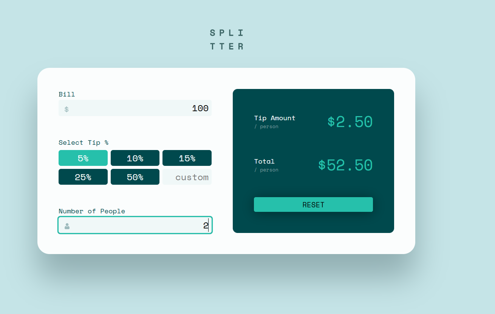

# Tip Calculator Application

This is a **Tip Calculator App** built using **React.js** and **CSS** for styling. The app allows users to calculate tips based on the bill amount, tip percentage, and the number of people sharing the bill. It provides a simple and intuitive interface for users to calculate tips accurately and efficiently.

## Features

### User Features:
1. **Home Page:**
   - Input fields for:
     - Bill amount.
     - Selectable tip percentages (e.g., 5%, 10%, 15%, etc.).
     - Custom tip percentage input.
     - Number of people sharing the bill.
   - Displays the calculated:
     - Tip amount per person.
     - Total amount per person (including the tip).
   - Reset button to clear all inputs and results.

2. **Responsive Design:**
   - The layout adjusts to various screen sizes for optimal usability on mobile, tablet, and desktop devices.

3. **Validation:**
   - Alerts or messages for invalid inputs:
     - Zero or negative values for bill amount or number of people.
     - Appropriate handling for decimal values.

4. **Real-time Calculation:**
   - As the user enters values or selects a tip percentage, the tip and total amounts are updated in real-time.

### Navigation Bar:
- **Logo/Title:** Displays the app name.
- **Reset Button:** Allows users to reset all fields to their default state.

## Technology Stack
- **Frontend:** React.js
- **Styling:** CSS (custom styling for a clean and modern look)

## Images




## Installation

To run this project locally, follow these steps:

1. Clone the repository:
   ```bash
   git clone https://github.com/your-username/tip-calculator-app.git
   ```

2. Install the dependencies:
   ```bash
   cd tip-calculator-app
   npm install
   ```

3. Start the React development server:
   ```bash
   npm start
   ```

4. Open the app in your browser:
   ```
   http://localhost:3000
   ```

## Future Enhancements
1. Add an option for splitting tips unevenly among different users.
2. Implement local storage to retain the last calculated tip and bill details.
3. Add a dark mode option for improved user experience.

